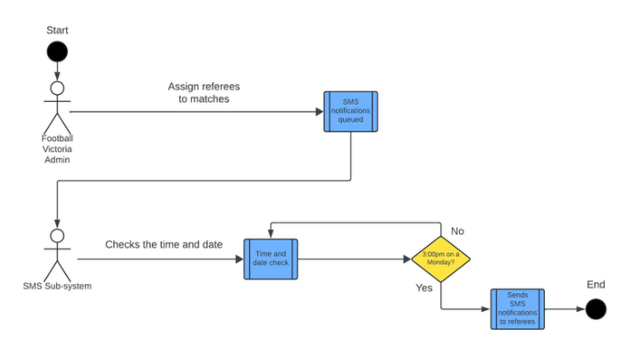
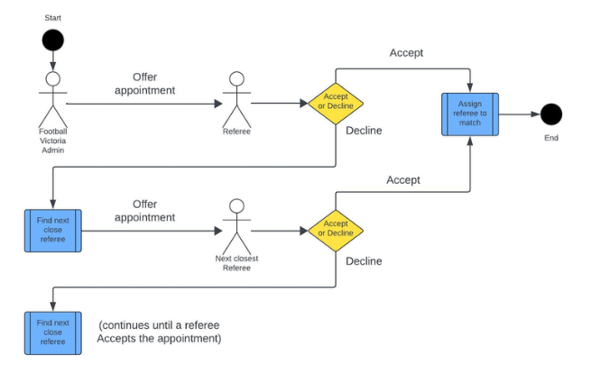

# Football Victoria Referee Management Platform

This project is a full-stack, web application for managing referee appointments and availability for Football Victoria. The Football Victoria Referees department aims to provide a better experience for referees when appointing them to soccer matches by improving their current process with automation and convenience oriented UX design. This platform adds graphical visualisation to the existing Referees Appointment System.

## Project Overview

The main goals of this platform are:

- Match referees to appointments based on location, experience, maturity, and appropriate age
- Improve accuracy, timing, and flexibility in the appointment process
- Address the issue of mass declines in age groups of U12, 13, and 14's fixtures
- Ensure higher acceptance of appointments

### Note: This is a fork of the main project and has the README abridged to solely cover my messaging functionality for portfolio presentation purposes. 

## SMS Messaging Sub-System

- The purpose of the SMS Sub-System is to streamline the process of offering appointments to referee's and enabling them to accept or decline them via SMS.
- The SMS Sub-System also automates the process of finding a new referee to oversee a given soccer match if the original referee declined the match.
- The automated re-assignment functionality pulls the referees who live near to the venue from the database, and offers it to them one by one until one accepts.
- By default, SMS messages offering match appointments are generated automatically when a match is created, and scheduled to be sent at 3:00pm on Monday afternoons.

## SMS Scheduling Diagram

### Demo 

### Appointment Re-assignnment Diagram

### Demo

